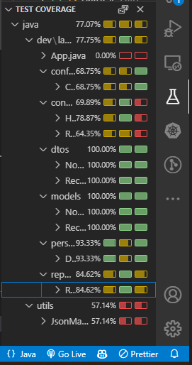
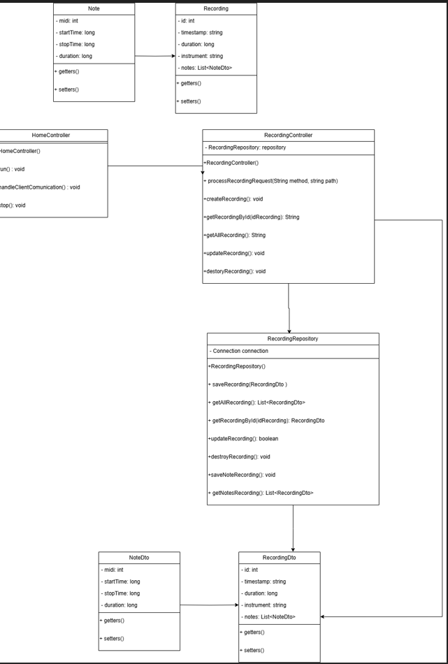

# 🎵 Aplicación de Instrumentos Musicales Interactiva - Backend

### 📌 Proyecto desarrollado en **Java** para la gestión de grabaciones, instrumentos y reproducción de canciones.

---

## 🚀 Descripción del Proyecto

El **Backend** de la **Aplicación de Instrumentos Musicales Interactiva** es un servidor desarrollado en **Java** que permite a los usuarios **tocar, grabar y reproducir música en línea**. Se encarga de procesar las grabaciones, gestionar las configuraciones de usuario y proporcionar datos a la interfaz web.

---

## 🏗️ Arquitectura del Backend

- **📡 Comunicación:** Uso de **Sockets (ServerSocket & Socket)** para la interacción con el frontend.
- **💾 Persistencia:** Almacenamiento en **archivos JSON** o **base de datos H2 en memoria**.
- **📝 API:** Endpoints para gestionar grabaciones, instrumentos y canciones.
- **🔒 Seguridad:** Validación de datos y manejo de errores en cada solicitud.
- **🧪 Pruebas:** Implementación de **JUnit 5** y **Hamcrest** con más del **70% de cobertura**.

---

## 📂 Estructura del Proyecto
```bash
backend/
│── src/
│   ├── dev/lanny/byte_beats_backend/
│   │   ├── controllers/    # Controladores que manejan la lógica del backend
│   │   ├── models/         # Clases que representan datos (Instrumentos, Grabaciones, etc.)
│   │   ├── repository/     # Persistencia de datos (JSON o H2)
│   │   ├── utils/          # Funciones auxiliares (Manejo de JSON, validaciones)
│── tests/                  # Pruebas unitarias con JUnit y Hamcrest
│── README.md               # Documentación del backend
│── data.json (Opcional)    # Datos de ejemplo en formato JSON
│── data.sql (Opcional)     # Script SQL para H2 en memoria

```
---

## ⚙️ Tecnologías Utilizadas

```bash
| 🛠️ **Tecnología**        | 📌 **Descripción**                                    
|-------------------------|---------------------------------------------------------|
| **Java (JDK 17)**       | Lenguaje de programación principal                      |
| **Sockets (ServerSocket & Socket)** | Comunicación entre el backend y el frontend |
| **H2 Database (Opcional)** | Base de datos en memoria para almacenar grabaciones  |
| **JSON (Opcional)**     | Almacenamiento de grabaciones en archivos JSON          |
| **JUnit 5**             | Framework para pruebas unitarias                        |
| **Hamcrest**            | Librería de aserciones para pruebas                     |
| **Git/GitHub**          | Control de versiones y trabajo colaborativo             |

```
---

## 📡 Cómo Ejecutar el Backend

### 🏗️ 1️⃣ Clonar el Repositorio
Para obtener una copia del código fuente en tu máquina local, clona el repositorio con:

```sh
git clone https://github.com/usuario/aplicacion-instrumentos.git
cd aplicacion-instrumentos/backend
```
---

## ⚙️ 2️⃣ Compilar el Proyecto
Antes de ejecutar el servidor, es necesario compilar los archivos de Java. Ejecuta el siguiente comando en la terminal:

```sh
javac -d out src/**/*.java
```
---

## ▶️ 3️⃣ Ejecutar el servidor
Para iniciar el backend, ejecuta el siguiente comando:

```sh
java -cp out dev.lanny.byte_beats_backend.Main
```
---

## 🛠️ 4️⃣ Configuración de Persistencia
El backend admite H2  almacenamiento:

| 💾 ** Opción**        | 📌 **Descripción**                                    
|-----------------------|--------------------------------------------------------------------|
| **H2 (en memoria)**   | Almacena datos en una base de datos temporal durante la ejecución. |


🔹 Usar Persistencia con H2
Verifica que data.sql está configurado correctamente.
La base de datos se cargará en memoria cada vez que el backend se ejecute.


## 🔄 5️⃣ Reiniciar el Servidor
Si realizas cambios en el código, reinicia el servidor con los siguientes pasos:

```sh
# Detener el servidor actual (si está corriendo)
CTRL + C

# Compilar nuevamente
javac -d out src/**/*.java

# Ejecutar el servidor otra vez
java -cp out dev.lanny.byte_beats_backend.Main
```
---

## 🚀 6️⃣ Probar la API con cURL o Postman
Para verificar que el backend responde correctamente, puedes usar cURL o Postman.

🔹 Probar que el backend responde correctamente

```sh
curl -X GET http://localhost:8080/recordings
```
---

## 🔌 API - Endpoints Disponibles

| 🛠️ **Método**  | 📌 **Ruta**         |      Descripción                |
|---------------- |---------------------|---------------------------------|
| **GET**         | /recordings         |Obtiene todas las grabaciones    |  
| **GET**         | /recordings/{id}    |Obtiene una grabación por ID     | 
| **POST**        | /recordings         |Crea una nueva grabación         |
| **PUT**         | /recordings/{id}    |Actualiza una grabación          |
| **DELETE**      | /recordings/{id}    |Elimina una grabación            | 


## 🧪 Pruebas y Cobertura

- **✔️ Se han implementado tests para:**

- **🔍 Obtener grabaciones (GET /recordings)**
- **📝 Crear grabaciones (POST /recordings)**
- **🛠️ Actualizar grabaciones (PUT /recordings/{id})**
- **❌ Manejo de errores (404 Not Found, 400 Bad Request)**
- **🚀 Pruebas de rendimiento (RecordingControllerTest.java)**




Diagrama UML de clases




